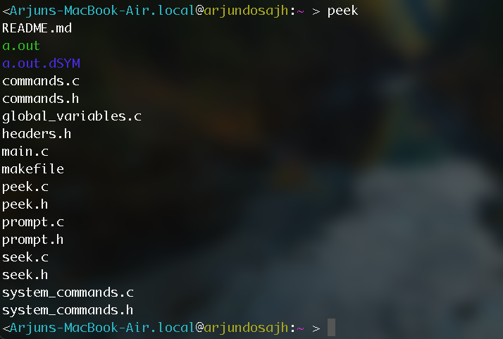

# Custom Shell Project

## Overview
This project involves building a custom shell in C, focusing on modular programming and encompassing a variety of shell functionalities such as system calls, command parsing, file and directory operations, process management, and networking.

## Features

### 1. Modular Code Structure
- **Implementation**: Divides the codebase into multiple C files, each dedicated to specific functionalities, enhancing code readability, maintainability, and scalability.

### 2. System Calls
- **Implementation**: Executes system commands in both foreground (waiting for completion) and background (allowing concurrent execution).

### 3. Command Parsing
- **Implementation**: Parses commands separated by ';' (sequential execution) or '&' (background execution), involving input string tokenization.

### 4. Directory Navigation (`warp`)
- **Implementation**: Changes the current working directory with support for relative, absolute paths, and special flags (".", "..", "~"), using system calls like `chdir`.

### 5. File Listing (`peek`)
- **Implementation**: Lists files and directories with options for hidden files (`-a`) and detailed information (`-l`), using system calls like `opendir` and `readdir`.

### 6. Command History (`pastevents`)
- **Implementation**: Stores and retrieves recent commands, maintaining a history buffer and excluding redundant entries like `pastevents` itself.

### 7. Process Management
- **Implementation**: Manages foreground and background processes, including custom commands for process information (`proclore`) and control (`fg`, `bg`), using system calls and signal handling.

### 8. I/O Redirection and Piping
- **Implementation**: Supports redirection (`>`, `>>`, `<`) and piping (`|`) between commands, involving file descriptor manipulation and pipe creation.

### 9. Networking (`iMan`)
- **Implementation**: Fetches manual pages from the internet using TCP sockets, HTTP requests, and response parsing.

## Additional Considerations

- **Error Handling**: Robust error handling to prevent crashes, checking system call return values and handling exceptions.
- **User Interface**: User-friendly interface with color coding and clear error messages.
- **Assumptions**: Simplifies implementation by assuming no whitespace in paths/names and no background processing for user-defined commands.

## Installation
1. Clone the repository.
2. Use the provided `makefile` to compile the code.
3. Run `./a.out` to start the shell.

## Usage
- Execute system or custom commands like `warp`, `peek`, `pastevents`.
- Use `;` or `&` to separate multiple commands.
- Navigate directories, list files, manage processes, and more.

## Contributing
Contributions to improve the shell or add new features are welcome. Please maintain the modular structure of the code.

## License
This project is distributed under the MIT License.

## Author
Arjun Dosajh
